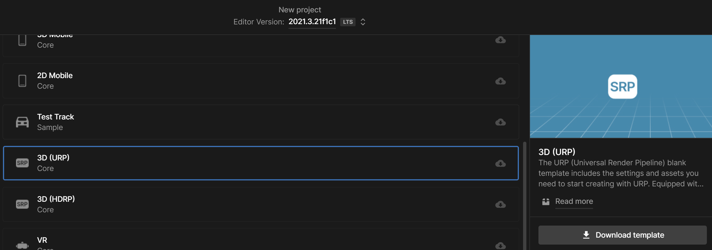

.. _doc_getting_started:

Getting Started
================

Unfortunately you cant make custom mods in game, you have to do that in the Unity Editor. Most 2021.2 LTS version should be compatible, Banana Shooter currently uses 2021.3.21f1c1. `View Download Links <https://unity.com/releases/editor/whats-new/2021.3.0>`_

Once Unity is installed, a project can be created to make custom mods **(make sure to choose URP on the create project menu because Banana Shooter is currently using URP so if your materials arent using the urp shader than it might can not be loaded in the game due to in-compatible)**

Make sure you are selecting the 3D URP when creating projects

Import BS Sdk
---------------
Once the 3D Urp project has been created you can then import the official bs sdk into the project:

  1.Go to the official `BS Sdk github repository <https://github.com/CodingDaniel1/BSSDK>`_, download the zip file then unzip it
  
  2.Drag both of the **AssetBundle** and **Scripts** folders into your project:Asset/ , and done you have imported the BS sdk successfully
  
Testing
----------------
To make sure you import the sdk successfully without any errors, its better to do a test for it

  1.Navigate to the top bar and click AssetBundle->Asset Bundle Creator
  
  .. image:: img/assetbundle-top-bar.png
  
  2.Click on the build asset bundle button
  
  .. image:: img/assetbundlecreator-showcase.png
  
  3.If you not having any errors and see this it means the bs sdk has completely imported with no errors and looking forward to make mods, if you do have a error then try to re-click the build button it should work fine then.
  
