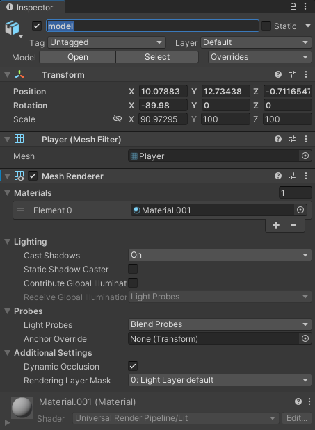
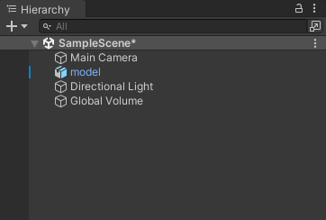
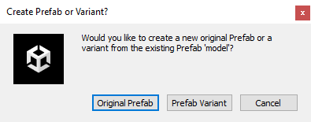
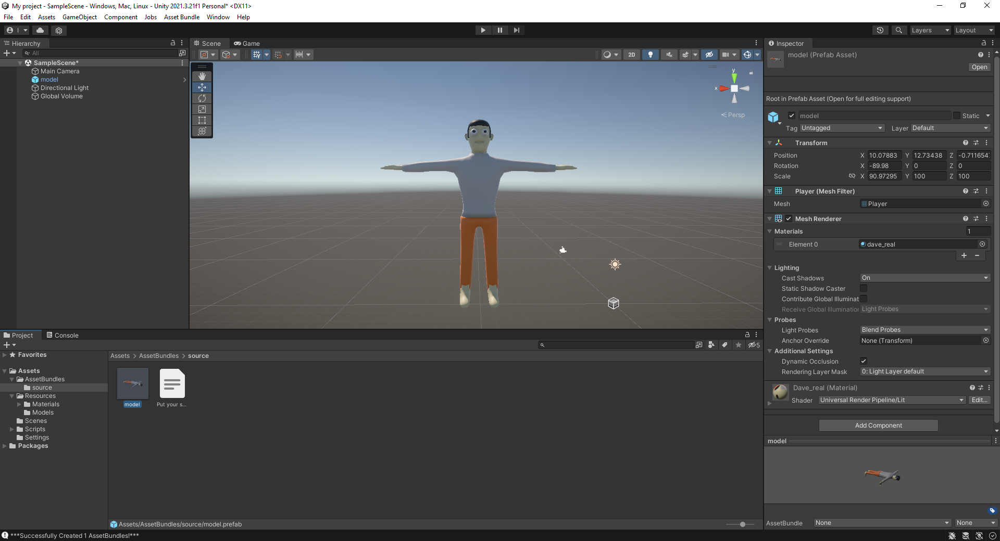
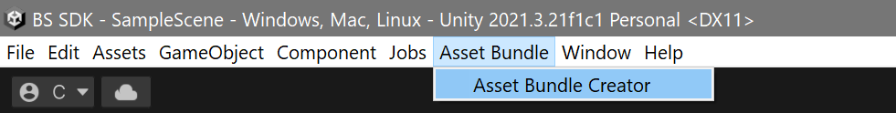
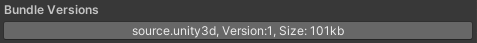

.. _doc_create_custom_models:

Create Custom Models
=================================

Getting Started
-------------------------------

To export your models for Banana Shooter's map editor, you will need to install Unity with the  Banana Shooter Software Development Kit imported (BS SDK)

Full tutorial here:

- :ref:`How To Install Unity And Import The BS SDK <doc_getting_started>`

How to setup your model in Unity
-----------------------------------------

First, we need to set everything up in Unity, so we can export models as ``source.unity3d`` files, which the game can read.

1. Create a folder in the Asset directory called ``Resources`` (This isn't necessary, but it's highly recommended for organization)
2. You can put all the models you wish to export in this folder. It is recommended to categorize the folder contents, such as putting models into an ``Asset\Resources\Models\`` folder and  materials in an ``Asset\Resources\Materials\`` folder, and so on
3. After importing the models, drag it into the scene and a GUI will open on the side called the inspector

4. Name the model ``model`` using the text box at the top of the inspector
5. If your model has a material, make sure to set it by dragging the material from the assets folder onto your model in the scene
6. Navigate to the ``Asset\AssetBundles\source`` folder and drag your model from the Hierarchy list into the source folder 

7. This will open a prompt. Select **Original Prefab**

8. Your project should now look something like this, and you are ready to export

How to export your model
-------------------------------

If there are no errors in your Console, then you can export your model

1. On the top of your screen, navigate to ``Asset Bundle > Asset Bundle Creator``

2. Click the ``Build Asset Bundles`` button, you **do not** have to play with the settings, they're already setup and messing with the settings might cause some bugs
3. After building your asset bundles, there should be a button under **Bundle Versions** that will look similar to below

4. Press this button and then ``Show in explorer`` to open it in File Explorer
5. If you see a file named ``source.unity3d`` then it has been successfully exported and you're ready to import it into Banana Shooter: :ref:`How To Import Custom Models <doc_import_custom_models>`
