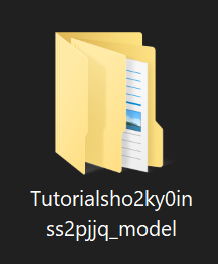

.. _doc_import_custom_models:

Import Custom Models
=============================

Where to put models
----------------------------------

First you have to save your map first to make sure the game can specify your models correctly. After saving the map please navigate to  ``...\Banana Shooter\Banana Shooter_Data\maps\``. If you saved the map properly you can see a folder called ``YOUR MAP NAME bunch of random letters_model``

It should look like this

  1.``Tutorial`` is the name of the map
  2.after ``Tutorial`` its the bunch of random words
  3.``_model`` means this is a model directory
