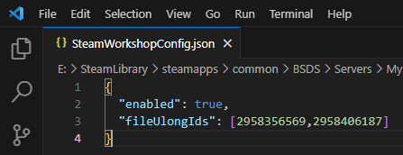

.. _doc_servers_workshop:

Setting Up Workshop Maps
=============================

Setting up your server to use workshop maps is simple

Enabling Workshop Mode
--------------

On each server, you must enable Steam Workshop. This removes all of the standard Banana Shooter maps from availability and instead uses a selected pool of Workshop maps

1. Find the ``SteamWorkshopConfig.json`` in your server directory (``...\BSDS\Servers\{serverName}``) and change ``"enabled"`` to ``true``

2. Get the item IDs for the Workshop items you want to use. This can be found in the link to the Workshop page. In the example below, the item ID is ``2958356569``

3. Paste item IDs in the ``"fileUlongIds"`` section seperated by a (``,``) comma

4. When you next launch your server, all Workshop maps will be downlaoded to ``...\BSDS\steamapps\workshop\content\1949740``

After you've done this, any other server will use this directory, so that you will not have to download the same workshop maps over and over again. You are free to enable and disable the Workshop for any server and also add or remove maps from the list. The server has to be restarted to apply changes to the Workshop
