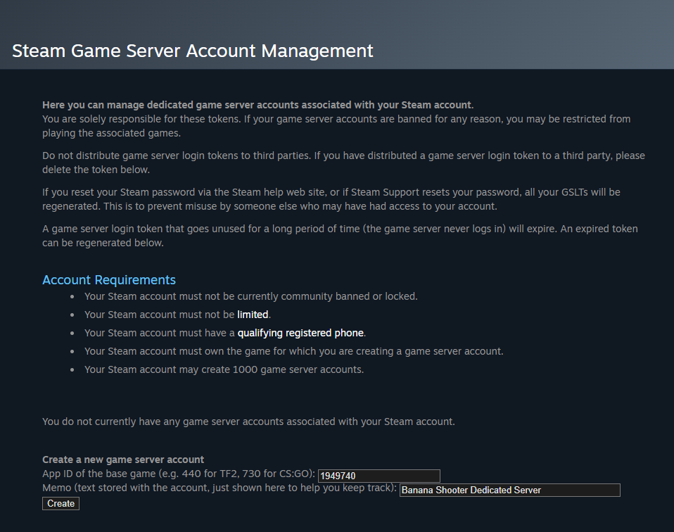
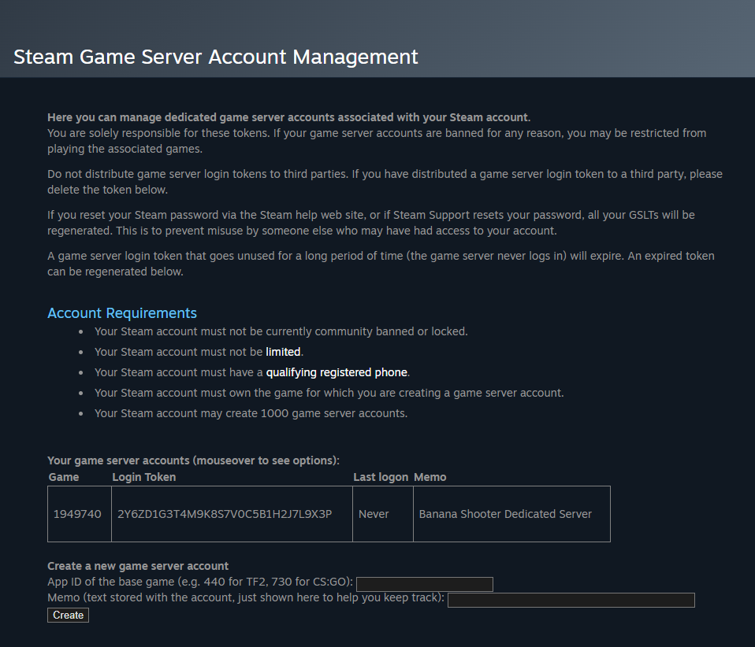
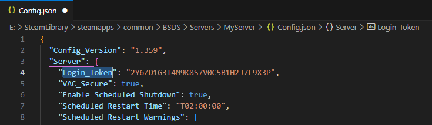

.. _doc_servers_gslt:

Game Server Login Tokens
=============================

Creating Game Server Login Tokens
--------------

1. Log into `Steam Game Server Account Management <https://steamcommunity.com/dev/managegameservers>`_ and use Banana Shooter's AppID ``1949740`` to create a new game server account. Make sure to add an appropriate memo to remember what the login token is for

2. Make a note of the login token and **do not share it**. You can always return to the page if you lose or forget it

Server Configuration
-----------------------

The token can be set in the ``Config.json`` file which is located at ``{steamLibrary}\BSDS\Servers\{serverName}`` `[How to find you installation files] <https://steamcommunity.com/sharedfiles/filedetails/?id=3012051276>`_

Paste the login token between the quotation marks of the ``Login_Token`` parameter

